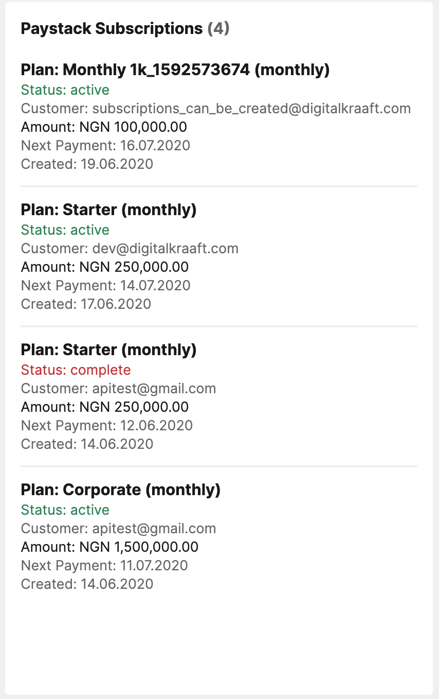

# A tile to show list of Paystack Customers on Laravel Dashboard

[](https://scrutinizer-ci.com/g/digikraaft/laravel-dashboard-paystack-subscriptions-tile/build-status/master)
[](https://scrutinizer-ci.com/g/digikraaft/laravel-dashboard-paystack-subscriptions-tile/?branch=master)
[](https://scrutinizer-ci.com/code-intelligence)
[](https://opensource.org/licenses/MIT)



This tile displays the list of [Paystack](https://paystack.com) subscriptions. 
It can be used on [the Laravel Dashboard](https://docs.spatie.be/laravel-dashboard).

## Installation

You can install the package via composer:

```bash
composer require digikraaft/laravel-dashboard-paystack-subscriptions-tile
```
You need to publish the migrations and config file of the [Laravel Dashboard](https://github.com/spatie/laravel-dashboard) package.
In the `dashboard` config file, you can optionally add this configuration in the tiles key and customize it for your own needs:
```
// in config/dashboard.php
'tiles' => [
        /**
         * Paystack configuration settings
         */
        'paystack' => [

            'secret_key' => env('PAYSTACK_SECRET'),

            'subscriptions' => [
                /**
                 * the values here must be supported by the Paystack API
                 * @link https://paystack.com/docs/api/#subscription-list
                 */
                'params' => [
                    'perPage' => 5,
                ],

                /**
                 * How often should the data be refreshed in seconds
                 */
                'refresh_interval_in_seconds' => 1800,
            ],
        ],
    ],
```
You must set your `PAYSTACK_SECRET` in the `.env` file. You can get this from your Paystack dashboard. 
To load subscriptions data from Paystack, you need to schedule the `FetchTransactionsDataFromPaystackApi`
command:
```
// in app/Console/Kernel.php
use Digikraaft\PaystackTransactionsTile\FetchTransactionsDataFromPaystackApi;

protected function schedule(Schedule $schedule)
{
    $schedule->command(FetchTransactionsDataFromPaystackApi::class)->daily();
}
```
You can change the frequency of the schedule as desired. You can also use the
`php artisan dashboard:fetch-subscriptions-data-from-paystack-api` command.

## Usage
In your dashboard view you use the `livewire:paystack-subscriptions-tile` component.
```html
<x-dashboard>
    <livewire:paystack-subscriptions-tile position="e7:e16" />
</x-dashboard>
```
You can add an optional title:
```html
<x-dashboard>
    <livewire:paystack-subscriptions-tile position="e7:e16" title="Paystack Transactions" />
</x-dashboard>
```

## Pagination
The package paginates data by default. The default value is 5. This can be changed by adding a `perPage`
property to the tile:
```html
<x-dashboard>
    <livewire:paystack-subscriptions-tile position="e7:e16" title="Paystack Transactions" perPage="10" />
</x-dashboard>
```

## Testing
Use the command below to run your tests:
``` bash
composer test
```

## More Good Stuff
Check [here](https://github.com/digikraaft) for more awesome free stuff!

## Changelog
Please see [CHANGELOG](CHANGELOG.md) for more information on what has changed recently.

## Contributing
Please see [CONTRIBUTING](CONTRIBUTING.md) for details.

## Security
If you discover any security related issues, please email dev@digitalkraaft.com instead of using the issue tracker.

## Credits
- [Tim Oladoyinbo](https://github.com/timoladoyinbo)
- [All Contributors](../../contributors)

## Thanks to
- [Spatie](https://github.com/spatie/) for the [Laravel Dashboard](https://github.com/spatie/laravel-dashboard) package

## License
The MIT License (MIT). Please see [License File](LICENSE.md) for more information.
